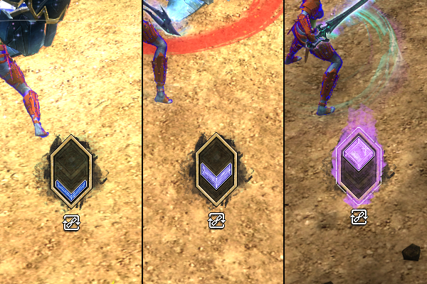
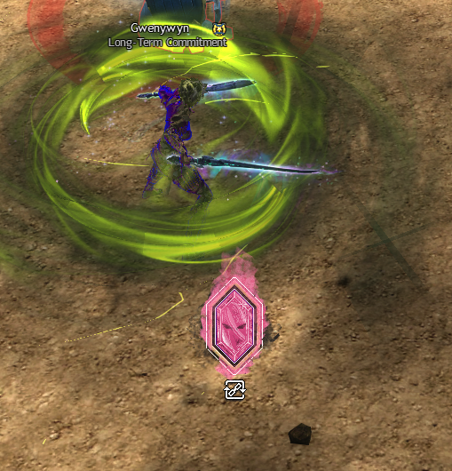

# Tempo

Reffect pack for Guild Wars 2. Requires https://github.com/Zerthox/gw2-reffect.

Simple indicator for which attack your skill slot 1 is currently on. It can help get the rhythm of auto-attack chains as well as stealth/ambush/unleashed skills that are temporarily accessed in slot 1.

- Supports all chains in slot 1, including underwater/kits/conjures
- Unique indicator for Stealth, Ambush, and Unleashed Ambush skills that overwrite normal slot 1 abilities
- A placeholder will be shown instead for weapons that have no auto-attack chain or stealth skills

Zip archive is available under Releases.

## Preview

### Chain: Start->Middle->End

### Stealth/Ambush

## Notes

Anomaly: Guardian hammer auto-attack animations especially with quickness appear to be partially desynced with the skill timing of the bar (which is what reffect looks at), and the final symbol attack completes _after_ it's already back to the "first" skill.
